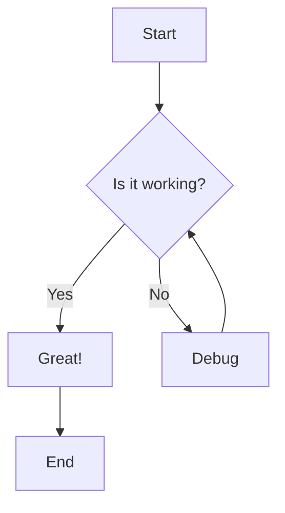

# Sample Markdown Document

This is a test markdown file to demonstrate the features of the Go Markdown Viewer.

## Features

- **Markdown rendering** with GFM support
- **Code highlighting** for various languages
- **Mermaid diagrams** for visualizations
- **Live reload** when files change

## Code Example

Here's a Go code example:

```go
package main

import "fmt"

func main() {
    fmt.Println("Hello, Markdown Viewer!")
}
```

## Python Example

```python
def fibonacci(n):
    if n <= 1:
        return n
    return fibonacci(n-1) + fibonacci(n-2)

print(fibonacci(10))
```

## Mermaid Diagram

Below is a flowchart created with Mermaid:



## Table Example

| Feature | Status | Priority |
|---------|--------|----------|
| Markdown | ✅ Done | High |
| Mermaid | ✅ Done | High |
| Live Reload | ✅ Done | High |
| Dark Theme | ✅ Done | Medium |

## Blockquote

> This is a blockquote. It can be used to highlight important information or quotes from other sources.

## Task List

- [x] Set up Go project
- [x] Implement file watcher
- [x] Add markdown rendering
- [x] Add Mermaid support
- [ ] Add more features as needed

## Conclusion

This markdown viewer provides a great way to view and edit markdown files with live reload functionality!
